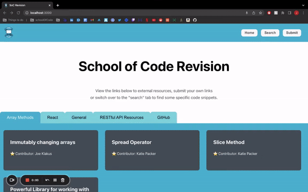
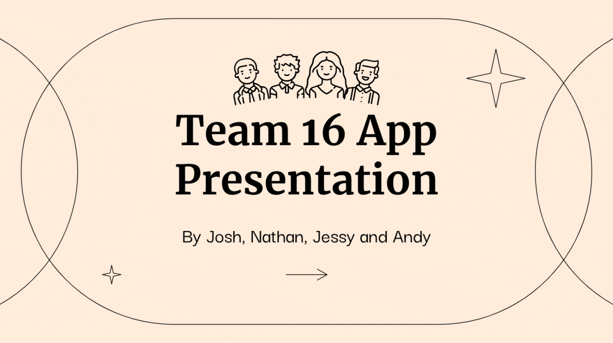

# School of Code Revision App

A Revision app for the School of Code. Initially created as a team of 4 in one week (5 days). The team consisted of myself, [Nathan Lee](https://github.com/N-LEE-94), [Jessy Yeh](https://github.com/Jessy-Yeh), and [Andy Johnson](https://github.com/multi-vit).
This repository was created so I could continue development for fun in my own time and showcase the work we completed during the project.

# Table of Contents

- **[The Project](#the-project)** 
- **[The Result](#the-result)** 
- **[Daily Breakdown](#daily-breakdown)** 
- **[Presentation](#day-5)** 
- **[My Further Developments](#my-further-developments)** 

## The Project

This project was completed for week 9 of our 16 week bootcamp. I personally only had 8 weeks of coding experience going into this project!

### The Brief

We had to use what we had learnt on the course up until that point to try and improve the lives of our fellow bootcampers. We had to consider our user's experiences and their problems. Specifically, we wanted to enhance the remote experience of a bootcamper, or find something that could help them with the vast amount of learning they're undertaking.

### The Problem & Our Solution

After sending out a survey to our fellow bootcampers we found what they wanted most was more time. As we couldn't code more hours into the day we decided to try and facilitate the best use of their time outside of bootcamp hours by creating a revision app.

## The Result

This repository was created on Saturday the 25th of June 2022. The initial commits in this repository represent the final product that my team created. The only difference is the fact that our front and backend were in separate repositories and this repository has them both in one place which required some structural changes to folders etc. Any changes from the projects' final result are outlined in the '[My Further Developments](##My-Further-Developments)' section.
Below is a gif demonstration of the app as it was on the final day of the project and the initial commit of this repository.

## Daily Breakdown

### Day 1

Day 1 consisted of meeting and getting to know our teammates. Before the project week I had only worked with one of my teammates so it was great getting to know some new people. We spent time creating a team manifesto highlighting our team principles, how we were going to make decisions and how we were going to resolve any disputes if they arose. We used Day 1 to work out who we were solving the problem for, what the problem was, how best to align with our target users in terms of creating a brand/user journey and what the priorities are to deliver value to our users. We then got the whole team set up so that we were all ready to code on the same page with a well planned backlog of tasks to deliver. We used the steps of Disney ideation and ensured we made space for all of the phases of the ideation process.

### Day 2

Day 2 was our first day of coding. At lunch we were able to connect our backend and front end. I personally worked on the front end on day two and we managed to get the home page functioning and styled! The other pair managed to set up our PostgreSQL tables and get routes for the links on the home page and the code snippets in the search page. They also set up the functionality for that in React.

### Day 3

Day 3 was all about testing. The pair I wasn't part of styled out the search page and looked into cypress whilst me and my pair began unit testing and integration testing our models and routes for our database. In the afternoon I swapped over to the front end to get unit tests on our components. At the end of day 3 we had our home page and search page functioning and fully tested. We still had a few final touches to add CSS wise.

### Day 4

On Day 4 we completed one of our stretch goals for the project. The submit page! Thanks to our app being well tested we were able to spin up the basic functionality quite fast whilst the other pair finished the styling final touches on the home and search page. Really focusing in on the responsiveness of the page. Once we had the functionality of the submit page going me and my pair began testing the new components we created whilst the other pair set up the post request and began testing that. One issue we ran into during testing was the fact our post tests would actually post to our database. We got around this by creating delete routes we could run at the end of the tests to simultaneously clean up after our other tests and test the delete route itself!

### Day 5

On our final day we spent the morning producing a presentation that could showcase our entire week. We had the pleasure of presenting our presentation to industry professionals! We got some feedback on the day and they were specifically impressed at how well our team tested and made sure testing was always part of our development. A selection of the slides are below but if you'd like to see all of the slides for our presentation click [here](https://docs.google.com/presentation/d/1USpVUdvC--K746eZuOxDgpzmlZ3o30jxzLUKJu-UtQk/edit?usp=sharing).

## My Further Developments

Here I will document any changes I make after the completion of the project.

- Combined both repositories from the project into this repository, removed the old READMEs, created this new README and created the images folder.
- Linked this repository to a personal database separate from the project database. Installed the SweetAlert npm package for better alerts on form submit and form 'missing fields' error.
- The week after our project we spent time reformatting our code to be more readable. We also created proper documentation. I have changed the code base in this project to be better formatted and more readable. I have also brought across the README.md we created and stored it in this repo.
- Deployment! The original repository is deployed.
