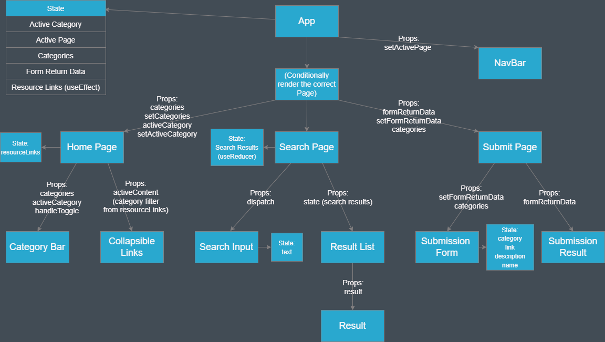

# Component Tree

## Description of each component's contents

### Home page

- Heading
- Page description

### Navbar

- Logo
- Home button
- Search button
- Submit a link button

### Category Bar

- Button (for each category)

### Collapsible Component (list of links)

- Link (for each link in resource links):
  - Description
  - Contributor
  - Category (not used yet)

### Search Page

- Heading
- Page description

### Search Input

- Text input
- Search button
- Random button

### Result List

- A list containing results

### Result

- Title
- Description
- Code snippet

### Submit a Link Page

- Heading
- Page description

### Submission Form

- Input for category (With label)
- Input for URL (With label)
- Input for description (With label)
- Input for name (With label)

### Submission Result

- Link
  - Description
  - Contributor
  - Category (not used yet)

## Component behaviour, state and props

### App

*state*

- Active category (for rendering the collapsible list of links)
- Active page (for conditionally rendering each page)
- Categories (for rendering the category bar)
- Form return data (for showing the result of link submission)
- Resource links (an array for displaying links)

*behaviour*

- Render the navbar component
- Render the active page component (starting with home), depending on which link is clicked in the navbar:
  - Home page
  - Search page
  - Submit a Link page
- Have a useEffect to send GET request for all links on page load and when a new link is submitted.
- Handle toggle function to allow toggling categories, that updates the active category state.

### Navbar

*props*

- Function to update active page state

*behaviour*

- Update the active page state with which button is clicked

### Home Page

*state*

- Resource Links

*props*

- Categories
- Function to update categories state
- Active category
- Function to update active category state

*behaviour*

- Render the category bar component
- Render the collapsible links component

### Category Bar

*props*

- Categories
- Active category
- Handle toggle function

*behaviour*

- Map through the categories and render a button for each one

### Collapsible Links

*props*

- Active content (category filter from Resource links state)

*behaviour*

- Map through the resource links and render a link for each one

### Search Page

*state*

- Reducer to store result of random or user search

*behaviour*

- Render Search Input component
- Render the Result List component

### Search Input

*state*

- Text to store user input

*props*

- Dispatch function to update state in Search Page

*behaviour*

- Make GET request for random code snippet
- Make GET request for code snippets with the category that matches user's input
- Update state of Search Page

### Result List

*props*

- Search results

*behaviour*

- Map through results and render a Result component for each one

### Result

*props*

- Result

*behaviour*

- Render the title(category), description and code snippet of the result prop

### Submit Page

*props*

- Form Return Data
- Function to update Form Return Data
- Categories

*behaviour*

- Render submission form component
- Render submission return component

### Submission Form

*props*

- Function to update Form Return Data
- Categories

*state*

- Text to handle each of the user input fields:
  - Categories
  - Link
  - Description
  - Name

*behaviour*

- Render a list of existing categories that user can select to add to
- Render input boxes for user to complete
- Render submit button
- Make a POST request to add a link to the Database
- Use the function to update the Form Return Data state in App

### Submission Form Return Link

*props*

- Form Return Data

*behaviour*

- Render what has been returned from the database after adding the link to give visual feedback to use that it worked
