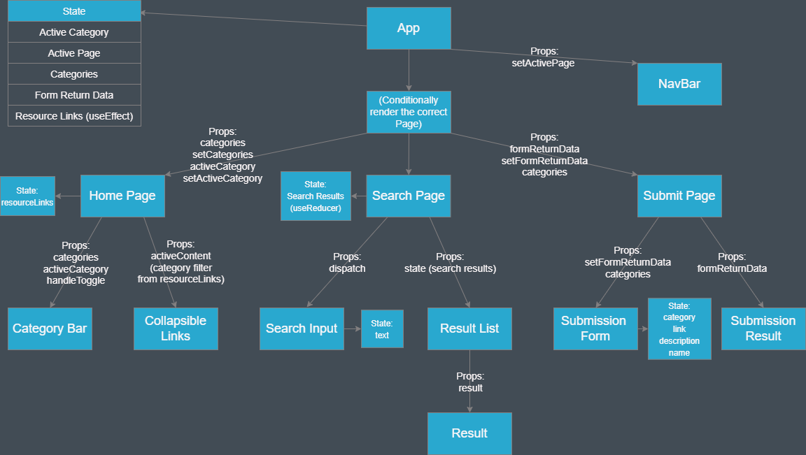

#    Dev.Revision App  

This document is intended for developers; it contains information regarding installation, component trees and the development process.

## Table of Contents

1. [Installation](#installation)
2. [Project Breakdown](#project-breakdown)
    1. [Component Tree](#component-tree)
    2. [CRUD routes](#crud-routes)
    3. [Testing](#testing)
    4. [Tech Stack](#tech-stack)
3. [Credits](#credits)

## Installation

Clone down this repository into your desired file location (HTTPS example)

```js
git clone "https://github.com/SchoolOfCode/w9_frontend-project-team-16.git"
```

CD into the Team 16 folder

```js
cd team-16
```

Then install the dependencies

```js
npm i
```

Then run the start script 

```js
npm start
```

This is set to run on localhost:3000.

#### Deployment Notice -
This will start up the front end of this application, it will interact with our API and make calls to the following URLS:

- For the 'links' on our homepage - https://revision-app-backend.herokuapp.com/links
- For the 'code snippets' on the search page - https://revision-app-backend.herokuapp.com/snippets

This API is deployed on and hosted by Heroku. 

To see how we have set up our API view the [backend repository](https://github.com/SchoolOfCode/w9_backend-project-team-16).

## Project Breakdown

### Component Tree

A markdown of the component tree can be found [here](https://github.com/SchoolOfCode/w9_frontend-project-team-16/blob/main/component-tree.md).



### CRUD routes

#### Create

- Users can post new links
- Stretch goal was to allow posting of code snippets

#### Read

- Gets all links on page load
- Gets code snippets by category or random (using ID)
- Stretch goal was to expand search functionality of code snippets

#### Update

- Not currently available
- Stretch goal was to allow users to update their own submissions to fix broken links, errors in code snippets etc.

#### Delete

- Not currently accessible to the user
- Used by front end and back end test suites to clean up after themselves (deleting what they post as part of the test)
- Stretch goal was to allow users to delete their own submissions

### Testing

#### Front End

- Unit tests to check the components render and contain expected items (excluding those that are just containers for other components such as ResultList and the 3 pages)
- Cypress end-to-end test to check a typical user journey through the app

#### Back End

- Unit tests to check the Models which query the database
- Integration tests to check the Routes which employ the Models to fetch from the database

### Tech stack

| Front End | Back End | Organisation Tools |
| --------- | -------- |  ----------------- |
|React JS   |PostgreSQL|Trello              |
|HTML       |Node JS   |Miro                |
|CSS        |Heroku    |Slack               |
|React Testing Library |Express JS|Google Jamboards|
|Jest       |Jest      |                    |
|Cypress    |Postman   |                    |
|           |Supertest |                    |

## Credits

**This app was developed by:**
*[Andy Johnson](https://github.com/multi-vit)*, *[Jessy Yeh](https://github.com/Jessy-Yeh)*, *[Josh Pattison](https://github.com/pattisoj)* and *[Nathan Lee](https://github.com/N-LEE-94).*

**Special thanks to:**
*[Adam Phasey](https://github.com/AdamPhasey)*, *[Claudia Gonzalez-Casales](https://github.com/ClaudiaGC1339)*, *[Skandy](https://github.com/skandog)* and *[Steven Cheung](https://github.com/StevenCK1)* for their insightful code reviews.

And to *[School of Code](https://www.schoolofcode.co.uk/)* for giving us our start as fullstack developers.
